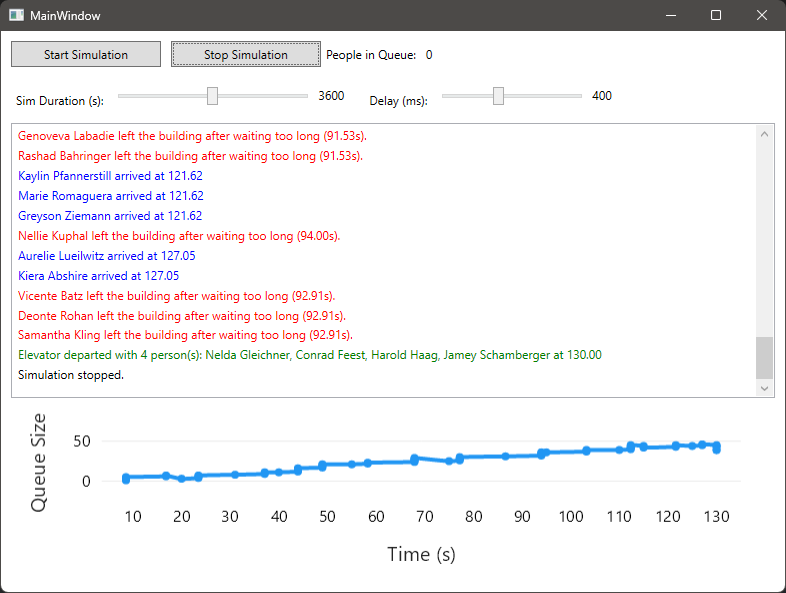

# Elevator Event Graph Simulation

Simulačný model výťahov vytvorený ako semestrálna úloha pre predmet **Modelovanie a Simulácia (BIAX20009)** na Fakulte informatiky (Paneurópska vysoká škola, Bratislava).



## 🧠 O projekte

Cieľom projektu je modelovať systém výťahov v budove pomocou **Grafu udalostí (Event Graph)** a pozorovať správanie systému v rôznych podmienkach:

- príchody osôb do haly
- obsluha výťahom (odchod, návrat)
- čakacie doby a fronty
- odchody osôb pri dlhom čakaní

## 😒 TODO
- paralelné udalosti (viac výťahov, poruchy...)

## 📦 Funkcie

- ⏳ **Simulačný kalendár** s priorizovanými udalosťami
- 🛗 Model jedného výťahu s realistickým stavom (v pohybe, návrat, dostupnosť)
- 👨‍👩‍👧‍👦 Príchody ľudí v náhodne veľkých skupinách
- 🚪 Odchody osôb, ktoré čakali príliš dlho
- 📈 Live graf počtu ľudí vo fronte
- 🧾 Farebný log udalostí podľa typu

---

## ▶️ Spustenie

### Závislosti

Projekt využíva:
- **C# 9 / .NET 9**
- **WPF** na vizualizáciu
- **LiveCharts2** na vykreslenie vývoja fronty
- **Bogus** na generovanie realistických mien osôb

- [.NET 9 SDK](https://dotnet.microsoft.com/en-us/download)
- Visual Studio 2022+ alebo Rider (preferred)
- NuGet balíky:
  - `LiveChartsCore.SkiaSharpView.WPF`
  - `Bogus`

### Build a run

```bash
dotnet restore
dotnet build
dotnet run
```
